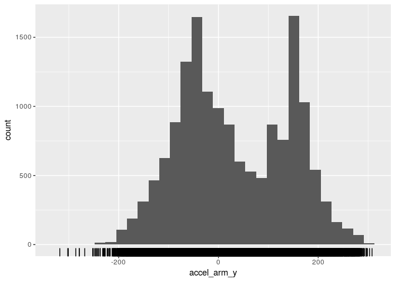
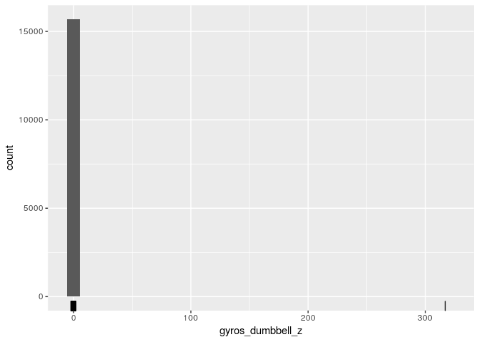
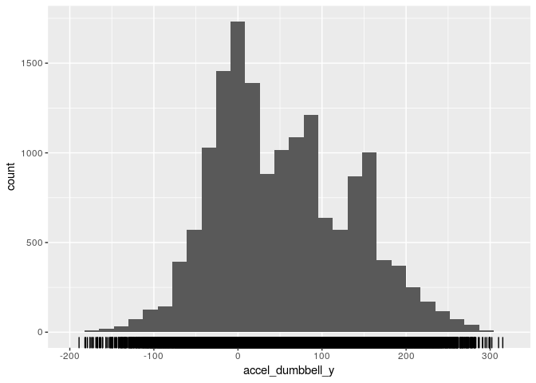
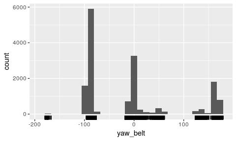
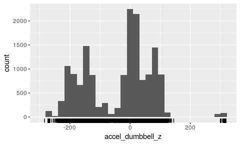
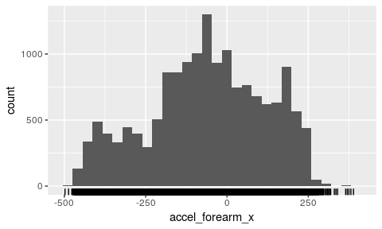

# Exploratory analysis for HAR workout data

## Introduction
In this file I present the exploratory of the Human  Activity Recognition workout data. The data was already cleaned up in the script data_cleaning.Rmd. To manage files I load my own functions:

```r
source('data_directories.R')
```
we also load the libraries that are needed and set the seed for reproducibility

```r
library(caret)
```

```
## Loading required package: lattice
```

```
## Loading required package: ggplot2
```

```r
set.seed(10819)
```

## Loading the data
In this file we focus on the original training dataset.

```r
data_dirname <- 'data'
clean_data_subdirname<-'clean'
training_clean<-paste(data_dirname,'/',clean_data_subdirname,'/','training_clean.csv',sep='')
training0 <- read.csv(training_clean)
training0<- training0[,2:(dim(training0)[[2]])]
head(training0)
```

```
##   user_name roll_belt pitch_belt yaw_belt total_accel_belt gyros_belt_x
## 1  carlitos      1.41       8.07    -94.4                3         0.00
## 2  carlitos      1.41       8.07    -94.4                3         0.02
## 3  carlitos      1.42       8.07    -94.4                3         0.00
## 4  carlitos      1.48       8.05    -94.4                3         0.02
## 5  carlitos      1.48       8.07    -94.4                3         0.02
## 6  carlitos      1.45       8.06    -94.4                3         0.02
##   gyros_belt_y gyros_belt_z accel_belt_x accel_belt_y accel_belt_z
## 1         0.00        -0.02          -21            4           22
## 2         0.00        -0.02          -22            4           22
## 3         0.00        -0.02          -20            5           23
## 4         0.00        -0.03          -22            3           21
## 5         0.02        -0.02          -21            2           24
## 6         0.00        -0.02          -21            4           21
##   magnet_belt_x magnet_belt_y magnet_belt_z roll_arm pitch_arm yaw_arm
## 1            -3           599          -313     -128      22.5    -161
## 2            -7           608          -311     -128      22.5    -161
## 3            -2           600          -305     -128      22.5    -161
## 4            -6           604          -310     -128      22.1    -161
## 5            -6           600          -302     -128      22.1    -161
## 6             0           603          -312     -128      22.0    -161
##   total_accel_arm gyros_arm_x gyros_arm_y gyros_arm_z accel_arm_x
## 1              34        0.00        0.00       -0.02        -288
## 2              34        0.02       -0.02       -0.02        -290
## 3              34        0.02       -0.02       -0.02        -289
## 4              34        0.02       -0.03        0.02        -289
## 5              34        0.00       -0.03        0.00        -289
## 6              34        0.02       -0.03        0.00        -289
##   accel_arm_y accel_arm_z magnet_arm_x magnet_arm_y magnet_arm_z
## 1         109        -123         -368          337          516
## 2         110        -125         -369          337          513
## 3         110        -126         -368          344          513
## 4         111        -123         -372          344          512
## 5         111        -123         -374          337          506
## 6         111        -122         -369          342          513
##   roll_dumbbell pitch_dumbbell yaw_dumbbell total_accel_dumbbell
## 1      13.05217      -70.49400    -84.87394                   37
## 2      13.13074      -70.63751    -84.71065                   37
## 3      12.85075      -70.27812    -85.14078                   37
## 4      13.43120      -70.39379    -84.87363                   37
## 5      13.37872      -70.42856    -84.85306                   37
## 6      13.38246      -70.81759    -84.46500                   37
##   gyros_dumbbell_x gyros_dumbbell_y gyros_dumbbell_z accel_dumbbell_x
## 1                0            -0.02             0.00             -234
## 2                0            -0.02             0.00             -233
## 3                0            -0.02             0.00             -232
## 4                0            -0.02            -0.02             -232
## 5                0            -0.02             0.00             -233
## 6                0            -0.02             0.00             -234
##   accel_dumbbell_y accel_dumbbell_z magnet_dumbbell_x magnet_dumbbell_y
## 1               47             -271              -559               293
## 2               47             -269              -555               296
## 3               46             -270              -561               298
## 4               48             -269              -552               303
## 5               48             -270              -554               292
## 6               48             -269              -558               294
##   magnet_dumbbell_z roll_forearm pitch_forearm yaw_forearm
## 1               -65         28.4         -63.9        -153
## 2               -64         28.3         -63.9        -153
## 3               -63         28.3         -63.9        -152
## 4               -60         28.1         -63.9        -152
## 5               -68         28.0         -63.9        -152
## 6               -66         27.9         -63.9        -152
##   total_accel_forearm gyros_forearm_x gyros_forearm_y gyros_forearm_z
## 1                  36            0.03            0.00           -0.02
## 2                  36            0.02            0.00           -0.02
## 3                  36            0.03           -0.02            0.00
## 4                  36            0.02           -0.02            0.00
## 5                  36            0.02            0.00           -0.02
## 6                  36            0.02           -0.02           -0.03
##   accel_forearm_x accel_forearm_y accel_forearm_z magnet_forearm_x
## 1             192             203            -215              -17
## 2             192             203            -216              -18
## 3             196             204            -213              -18
## 4             189             206            -214              -16
## 5             189             206            -214              -17
## 6             193             203            -215               -9
##   magnet_forearm_y magnet_forearm_z classe
## 1              654              476      A
## 2              661              473      A
## 3              658              469      A
## 4              658              469      A
## 5              655              473      A
## 6              660              478      A
```
Because the testing data is not labeled I will create my own train/test split so that after I have trained the models and cross-validated to choose the best one, then I can have a good measure of the "out of sample error"

```r
indTrain<-createDataPartition(training0$classe,p=0.80,list=FALSE)
training<-training0[indTrain,]
dim(training)
```

```
## [1] 15699    54
```

```r
testing<-training0[-indTrain,]
dim(testing)
```

```
## [1] 3923   54
```

## Exploratory Analysis

In this data set we have mostly numeric data features and only a categorical feature which is the user name. Thus, it makes sense by starting to investigate outliers, correlations (i.e. apply PCA), check if there are features that it makes sense to engineer. and apply feature scaling. Things to check are:
  
* **Feature scalling and Outliers**: Here we can start by plotting distributions and then do feature scalling and then check for points away from the center of the distribution
* **Relations between features**: By plotting pairs of features and checking if we could apply some transformations????
* **Check if PCA is needed**: 

### Checking for outliers
Let us start by histograming the distribution of the categorical 'user_name'

```r
barplot(table(training['user_name']))
```

<!-- -->
So we see that the data is well balanced among users. 
Let us start by plotting the distributions of the 52 numerical features. We will use ggplot and make a grid

```r
library(ggplot2)
```


```r
numeric_vars<-colnames(training)[2:(length(colnames(training))-1)]
df<-as.data.frame(lapply(training[numeric_vars],as.numeric))
for(var in numeric_vars){
p1<-ggplot(df,aes(df[var]))+geom_histogram()+xlab(var)+geom_rug()
show(p1)
}
```

```
## Don't know how to automatically pick scale for object of type data.frame. Defaulting to continuous.
```

```
## `stat_bin()` using `bins = 30`. Pick better value with `binwidth`.
```

<!-- -->

```
## Don't know how to automatically pick scale for object of type data.frame. Defaulting to continuous.
## `stat_bin()` using `bins = 30`. Pick better value with `binwidth`.
```

<!-- -->

```
## Don't know how to automatically pick scale for object of type data.frame. Defaulting to continuous.
## `stat_bin()` using `bins = 30`. Pick better value with `binwidth`.
```

<!-- -->

```
## Don't know how to automatically pick scale for object of type data.frame. Defaulting to continuous.
## `stat_bin()` using `bins = 30`. Pick better value with `binwidth`.
```

<!-- -->

```
## Don't know how to automatically pick scale for object of type data.frame. Defaulting to continuous.
## `stat_bin()` using `bins = 30`. Pick better value with `binwidth`.
```

<!-- -->

```
## Don't know how to automatically pick scale for object of type data.frame. Defaulting to continuous.
## `stat_bin()` using `bins = 30`. Pick better value with `binwidth`.
```

<!-- -->

```
## Don't know how to automatically pick scale for object of type data.frame. Defaulting to continuous.
## `stat_bin()` using `bins = 30`. Pick better value with `binwidth`.
```

<!-- -->

```
## Don't know how to automatically pick scale for object of type data.frame. Defaulting to continuous.
## `stat_bin()` using `bins = 30`. Pick better value with `binwidth`.
```

<!-- -->

```
## Don't know how to automatically pick scale for object of type data.frame. Defaulting to continuous.
## `stat_bin()` using `bins = 30`. Pick better value with `binwidth`.
```

<!-- -->

```
## Don't know how to automatically pick scale for object of type data.frame. Defaulting to continuous.
## `stat_bin()` using `bins = 30`. Pick better value with `binwidth`.
```

<!-- -->

```
## Don't know how to automatically pick scale for object of type data.frame. Defaulting to continuous.
## `stat_bin()` using `bins = 30`. Pick better value with `binwidth`.
```

<!-- -->

```
## Don't know how to automatically pick scale for object of type data.frame. Defaulting to continuous.
## `stat_bin()` using `bins = 30`. Pick better value with `binwidth`.
```

<!-- -->

```
## Don't know how to automatically pick scale for object of type data.frame. Defaulting to continuous.
## `stat_bin()` using `bins = 30`. Pick better value with `binwidth`.
```

<!-- -->

```
## Don't know how to automatically pick scale for object of type data.frame. Defaulting to continuous.
## `stat_bin()` using `bins = 30`. Pick better value with `binwidth`.
```

<!-- -->

```
## Don't know how to automatically pick scale for object of type data.frame. Defaulting to continuous.
## `stat_bin()` using `bins = 30`. Pick better value with `binwidth`.
```

<!-- -->

```
## Don't know how to automatically pick scale for object of type data.frame. Defaulting to continuous.
## `stat_bin()` using `bins = 30`. Pick better value with `binwidth`.
```

<!-- -->

```
## Don't know how to automatically pick scale for object of type data.frame. Defaulting to continuous.
## `stat_bin()` using `bins = 30`. Pick better value with `binwidth`.
```

<!-- -->

```
## Don't know how to automatically pick scale for object of type data.frame. Defaulting to continuous.
## `stat_bin()` using `bins = 30`. Pick better value with `binwidth`.
```

<!-- -->

```
## Don't know how to automatically pick scale for object of type data.frame. Defaulting to continuous.
## `stat_bin()` using `bins = 30`. Pick better value with `binwidth`.
```

<!-- -->

```
## Don't know how to automatically pick scale for object of type data.frame. Defaulting to continuous.
## `stat_bin()` using `bins = 30`. Pick better value with `binwidth`.
```

<!-- -->

```
## Don't know how to automatically pick scale for object of type data.frame. Defaulting to continuous.
## `stat_bin()` using `bins = 30`. Pick better value with `binwidth`.
```

<!-- -->

```
## Don't know how to automatically pick scale for object of type data.frame. Defaulting to continuous.
## `stat_bin()` using `bins = 30`. Pick better value with `binwidth`.
```

<!-- -->

```
## Don't know how to automatically pick scale for object of type data.frame. Defaulting to continuous.
## `stat_bin()` using `bins = 30`. Pick better value with `binwidth`.
```

<!-- -->

```
## Don't know how to automatically pick scale for object of type data.frame. Defaulting to continuous.
## `stat_bin()` using `bins = 30`. Pick better value with `binwidth`.
```

<!-- -->

```
## Don't know how to automatically pick scale for object of type data.frame. Defaulting to continuous.
## `stat_bin()` using `bins = 30`. Pick better value with `binwidth`.
```

<!-- -->

```
## Don't know how to automatically pick scale for object of type data.frame. Defaulting to continuous.
## `stat_bin()` using `bins = 30`. Pick better value with `binwidth`.
```

<!-- -->

```
## Don't know how to automatically pick scale for object of type data.frame. Defaulting to continuous.
## `stat_bin()` using `bins = 30`. Pick better value with `binwidth`.
```

<!-- -->

```
## Don't know how to automatically pick scale for object of type data.frame. Defaulting to continuous.
## `stat_bin()` using `bins = 30`. Pick better value with `binwidth`.
```

<!-- -->

```
## Don't know how to automatically pick scale for object of type data.frame. Defaulting to continuous.
## `stat_bin()` using `bins = 30`. Pick better value with `binwidth`.
```

<!-- -->

```
## Don't know how to automatically pick scale for object of type data.frame. Defaulting to continuous.
## `stat_bin()` using `bins = 30`. Pick better value with `binwidth`.
```

<!-- -->

```
## Don't know how to automatically pick scale for object of type data.frame. Defaulting to continuous.
## `stat_bin()` using `bins = 30`. Pick better value with `binwidth`.
```

<!-- -->

```
## Don't know how to automatically pick scale for object of type data.frame. Defaulting to continuous.
## `stat_bin()` using `bins = 30`. Pick better value with `binwidth`.
```

<!-- -->

```
## Don't know how to automatically pick scale for object of type data.frame. Defaulting to continuous.
## `stat_bin()` using `bins = 30`. Pick better value with `binwidth`.
```

<!-- -->

```
## Don't know how to automatically pick scale for object of type data.frame. Defaulting to continuous.
## `stat_bin()` using `bins = 30`. Pick better value with `binwidth`.
```

<!-- -->

```
## Don't know how to automatically pick scale for object of type data.frame. Defaulting to continuous.
## `stat_bin()` using `bins = 30`. Pick better value with `binwidth`.
```

<!-- -->

```
## Don't know how to automatically pick scale for object of type data.frame. Defaulting to continuous.
## `stat_bin()` using `bins = 30`. Pick better value with `binwidth`.
```

<!-- -->

```
## Don't know how to automatically pick scale for object of type data.frame. Defaulting to continuous.
## `stat_bin()` using `bins = 30`. Pick better value with `binwidth`.
```

<!-- -->

```
## Don't know how to automatically pick scale for object of type data.frame. Defaulting to continuous.
## `stat_bin()` using `bins = 30`. Pick better value with `binwidth`.
```

<!-- -->

```
## Don't know how to automatically pick scale for object of type data.frame. Defaulting to continuous.
## `stat_bin()` using `bins = 30`. Pick better value with `binwidth`.
```

<!-- -->

```
## Don't know how to automatically pick scale for object of type data.frame. Defaulting to continuous.
## `stat_bin()` using `bins = 30`. Pick better value with `binwidth`.
```

<!-- -->

```
## Don't know how to automatically pick scale for object of type data.frame. Defaulting to continuous.
## `stat_bin()` using `bins = 30`. Pick better value with `binwidth`.
```

<!-- -->

```
## Don't know how to automatically pick scale for object of type data.frame. Defaulting to continuous.
## `stat_bin()` using `bins = 30`. Pick better value with `binwidth`.
```

<!-- -->

```
## Don't know how to automatically pick scale for object of type data.frame. Defaulting to continuous.
## `stat_bin()` using `bins = 30`. Pick better value with `binwidth`.
```

<!-- -->

```
## Don't know how to automatically pick scale for object of type data.frame. Defaulting to continuous.
## `stat_bin()` using `bins = 30`. Pick better value with `binwidth`.
```

<!-- -->

```
## Don't know how to automatically pick scale for object of type data.frame. Defaulting to continuous.
## `stat_bin()` using `bins = 30`. Pick better value with `binwidth`.
```

<!-- -->

```
## Don't know how to automatically pick scale for object of type data.frame. Defaulting to continuous.
## `stat_bin()` using `bins = 30`. Pick better value with `binwidth`.
```

<!-- -->

```
## Don't know how to automatically pick scale for object of type data.frame. Defaulting to continuous.
## `stat_bin()` using `bins = 30`. Pick better value with `binwidth`.
```

<!-- -->

```
## Don't know how to automatically pick scale for object of type data.frame. Defaulting to continuous.
## `stat_bin()` using `bins = 30`. Pick better value with `binwidth`.
```

<!-- -->

```
## Don't know how to automatically pick scale for object of type data.frame. Defaulting to continuous.
## `stat_bin()` using `bins = 30`. Pick better value with `binwidth`.
```

<!-- -->

```
## Don't know how to automatically pick scale for object of type data.frame. Defaulting to continuous.
## `stat_bin()` using `bins = 30`. Pick better value with `binwidth`.
```

<!-- -->

```
## Don't know how to automatically pick scale for object of type data.frame. Defaulting to continuous.
## `stat_bin()` using `bins = 30`. Pick better value with `binwidth`.
```

<!-- -->

```
## Don't know how to automatically pick scale for object of type data.frame. Defaulting to continuous.
## `stat_bin()` using `bins = 30`. Pick better value with `binwidth`.
```

<!-- -->

We see from these plots that some of the gyros variables seem to have some outliers all other distributions look ok. So we will first do identify the outliers automatically to see what it going on there. 

```r
list_bad<-character()
list_bad
```

```
## character(0)
```

```r
for(name in colnames(df)){
  # compute mean
  meanval<-mean(as.vector(df[,name]))
  # compute standard deviation
  sdval<-sd(as.vector(df[,name]))
  df_temp<-df[as.vector((df[name]>(meanval+10*sdval)) | (df[name]<(meanval-10*sdval))),]
  if(dim(df_temp)[[1]]>0){
    list_bad<-append(list_bad,rownames(df_temp))
  }
}
indBad<-as.numeric(unique(list_bad))
df2<-df[-indBad,]
```


```r
for(var in numeric_vars){
p1<-ggplot(df2,aes(df2[var]))+geom_histogram()+xlab(var)+geom_rug()
show(p1)
}
```

<!-- --><!-- --><!-- --><!-- --><!-- --><!-- --><!-- --><!-- --><!-- --><!-- --><!-- --><!-- --><!-- --><!-- --><!-- --><!-- --><!-- --><!-- --><!-- --><!-- --><!-- --><!-- --><!-- --><!-- --><!-- --><!-- --><!-- --><!-- --><!-- --><!-- --><!-- --><!-- --><!-- --><!-- --><!-- --><!-- --><!-- --><!-- --><!-- --><!-- --><!-- --><!-- --><!-- --><!-- --><!-- --><!-- --><!-- --><!-- --><!-- --><!-- --><!-- --><!-- -->
So now we take the training data and also remove the outliers

```r
training_no_outliers<-training[-indBad,]
```

### Pre-processing: Feature scaling and PCA


```r
preObj<-preProcess(training_no_outliers[-c(1,54)],method=c('center','scale'))
training_pre1<-predict(preObj,training_no_outliers[-c(1,54)])
training_pre1['user_name']<-training_no_outliers[1]
training_pre1['classe']<-training_no_outliers[54]
head(training_pre1)
```

```
##   roll_belt pitch_belt   yaw_belt total_accel_belt gyros_belt_x
## 1 -1.006220  0.3543698 -0.8751425          -1.0754   0.02651137
## 2 -1.006220  0.3543698 -0.8751425          -1.0754   0.12457252
## 3 -1.006061  0.3543698 -0.8751425          -1.0754   0.02651137
## 4 -1.005105  0.3534784 -0.8751425          -1.0754   0.12457252
## 5 -1.005105  0.3543698 -0.8751425          -1.0754   0.12457252
## 6 -1.005583  0.3539241 -0.8751425          -1.0754   0.12457252
##   gyros_belt_y gyros_belt_z accel_belt_x accel_belt_y accel_belt_z
## 1   -0.5126778    0.4571049   -0.5244500   -0.9169416    0.9441165
## 2   -0.5126778    0.4571049   -0.5580288   -0.9169416    0.9441165
## 3   -0.5126778    0.4571049   -0.4908713   -0.8818598    0.9540723
## 4   -0.5126778    0.4155900   -0.5580288   -0.9520234    0.9341607
## 5   -0.2555115    0.4571049   -0.5244500   -0.9871052    0.9640281
## 6   -0.5126778    0.4571049   -0.5244500   -0.9169416    0.9341607
##   magnet_belt_x magnet_belt_y magnet_belt_z roll_arm pitch_arm   yaw_arm
## 1    -0.9162229     0.1490258     0.4970822 -2.00523 0.8813332 -2.232693
## 2    -0.9784571     0.4020300     0.5277931 -2.00523 0.8813332 -2.232693
## 3    -0.9006643     0.1771374     0.6199257 -2.00523 0.8813332 -2.232693
## 4    -0.9628985     0.2895837     0.5431485 -2.00523 0.8682868 -2.232693
## 5    -0.9628985     0.1771374     0.6659920 -2.00523 0.8682868 -2.232693
## 6    -0.8695472     0.2614721     0.5124377 -2.00523 0.8650252 -2.232693
##   total_accel_arm gyros_arm_x gyros_arm_y gyros_arm_z accel_arm_x
## 1       0.8095805 -0.02108561   0.3043628  -0.5253616   -1.249583
## 2       0.8095805 -0.01103398   0.2807824  -0.5253616   -1.260591
## 3       0.8095805 -0.01103398   0.2807824  -0.5253616   -1.255087
## 4       0.8095805 -0.01103398   0.2689922  -0.4530687   -1.255087
## 5       0.8095805 -0.02108561   0.2689922  -0.4892152   -1.255087
## 6       0.8095805 -0.01103398   0.2689922  -0.4892152   -1.255087
##   accel_arm_y accel_arm_z magnet_arm_x magnet_arm_y magnet_arm_z
## 1   0.6934034  -0.3873786    -1.258052    0.8883726    0.6389036
## 2   0.7024761  -0.4022430    -1.260307    0.8883726    0.6297123
## 3   0.7024761  -0.4096753    -1.258052    0.9229808    0.6297123
## 4   0.7115489  -0.3873786    -1.267072    0.9229808    0.6266485
## 5   0.7115489  -0.3873786    -1.271582    0.8883726    0.6082659
## 6   0.7115489  -0.3799463    -1.260307    0.9130927    0.6297123
##   roll_dumbbell pitch_dumbbell yaw_dumbbell total_accel_dumbbell
## 1    -0.1602836      -1.616182    -1.047114             2.274988
## 2    -0.1591568      -1.620057    -1.045136             2.274988
## 3    -0.1631727      -1.610353    -1.050346             2.274988
## 4    -0.1548472      -1.613477    -1.047110             2.274988
## 5    -0.1556000      -1.614415    -1.046861             2.274988
## 6    -0.1555463      -1.624920    -1.042162             2.274988
##   gyros_dumbbell_x gyros_dumbbell_y gyros_dumbbell_z accel_dumbbell_x
## 1       -0.4406595       -0.1330496        0.4472434        -3.048752
## 2       -0.4406595       -0.1330496        0.4472434        -3.033907
## 3       -0.4406595       -0.1330496        0.4472434        -3.019063
## 4       -0.4406595       -0.1330496        0.3850711        -3.019063
## 5       -0.4406595       -0.1330496        0.4472434        -3.033907
## 6       -0.4406595       -0.1330496        0.4472434        -3.048752
##   accel_dumbbell_y accel_dumbbell_z magnet_dumbbell_x magnet_dumbbell_y
## 1      -0.07297744        -2.121738        -0.6774185         0.2192149
## 2      -0.07297744        -2.103489        -0.6656260         0.2284438
## 3      -0.08538541        -2.112613        -0.6833148         0.2345964
## 4      -0.06056947        -2.103489        -0.6567816         0.2499779
## 5      -0.06056947        -2.112613        -0.6626778         0.2161386
## 6      -0.06056947        -2.103489        -0.6744704         0.2222912
##   magnet_dumbbell_z roll_forearm pitch_forearm yaw_forearm
## 1        -0.7957835  -0.05294168     -2.650673   -1.675825
## 2        -0.7886318  -0.05387041     -2.650673   -1.675825
## 3        -0.7814801  -0.05387041     -2.650673   -1.666105
## 4        -0.7600251  -0.05572785     -2.650673   -1.666105
## 5        -0.8172385  -0.05665658     -2.650673   -1.666105
## 6        -0.8029352  -0.05758530     -2.650673   -1.666105
##   total_accel_forearm gyros_forearm_x gyros_forearm_y gyros_forearm_z
## 1           0.1220032      -0.2122367     -0.02728653      -0.2671456
## 2           0.1220032      -0.2281333     -0.02728653      -0.2671456
## 3           0.1220032      -0.2122367     -0.03654615      -0.2338586
## 4           0.1220032      -0.2281333     -0.03654615      -0.2338586
## 5           0.1220032      -0.2281333     -0.02728653      -0.2671456
## 6           0.1220032      -0.2281333     -0.03654615      -0.2837891
##   accel_forearm_x accel_forearm_y accel_forearm_z magnet_forearm_x
## 1        1.402478       0.1928744       -1.156493        0.8513603
## 2        1.402478       0.1928744       -1.163730        0.8484764
## 3        1.424607       0.1978629       -1.142019        0.8484764
## 4        1.385882       0.2078399       -1.149256        0.8542443
## 5        1.385882       0.2078399       -1.149256        0.8513603
## 6        1.408011       0.1928744       -1.156493        0.8744320
##   magnet_forearm_y magnet_forearm_z user_name classe
## 1        0.5378816        0.2192474  carlitos      A
## 2        0.5516354        0.2111022  carlitos      A
## 3        0.5457409        0.2002419  carlitos      A
## 4        0.5457409        0.2002419  carlitos      A
## 5        0.5398464        0.2111022  carlitos      A
## 6        0.5496706        0.2246775  carlitos      A
```
Let's now experiment PCA

```r
PCA_vals<-prcomp(training_pre1[-c(53,54)])
PCA_vals$sdev
```

```
##  [1] 2.89420816 2.86726462 2.19578292 1.93145817 1.77492751 1.52011140
##  [7] 1.45121328 1.41233194 1.31608165 1.28488293 1.17795775 1.14671436
## [13] 1.09414989 0.99319214 0.92301060 0.88816292 0.84635496 0.82694286
## [19] 0.80738499 0.70402479 0.68452047 0.65182785 0.63421524 0.59289951
## [25] 0.58417622 0.55305837 0.54812508 0.51778743 0.50457984 0.48074639
## [31] 0.45296754 0.42460371 0.37880302 0.36045108 0.34201517 0.32737470
## [37] 0.30063955 0.28078922 0.25249689 0.23717434 0.23349981 0.19886998
## [43] 0.18979979 0.18272704 0.17904930 0.16555485 0.16245049 0.14484424
## [49] 0.14076667 0.10899641 0.07705761 0.04629220
```

```r
sum(PCA_vals$sdev[1:35])/sum(PCA_vals$sdev)
```

```
## [1] 0.917211
```
So it is not clear if some PCs are more useful than others. I think there is not point on dropping more variables.

### Some further exploratory plots

Now we should make some further plots to understand the relation between the various classes and the variables. Things I would like to do are as follows:

* Repeat distributions but now on each plot there is a color for each classe


```r
for(var in numeric_vars){
p1<-ggplot(training_pre1,aes(training_pre1[var],fill=classe))+xlab(var)+
    geom_histogram()
show(p1)
}
```

<!-- --><!-- --><!-- --><!-- --><!-- --><!-- --><!-- --><!-- --><!-- --><!-- --><!-- --><!-- --><!-- --><!-- --><!-- --><!-- --><!-- --><!-- --><!-- --><!-- --><!-- --><!-- --><!-- --><!-- --><!-- --><!-- --><!-- --><!-- --><!-- --><!-- --><!-- --><!-- --><!-- --><!-- --><!-- --><!-- --><!-- --><!-- --><!-- --><!-- --><!-- --><!-- --><!-- --><!-- --><!-- --><!-- --><!-- --><!-- --><!-- --><!-- --><!-- --><!-- -->
Now we will try to figure out useful projections to make some scatter plots. First we split the variables in groups


```r
numeric_vars
```

```
##  [1] "roll_belt"            "pitch_belt"           "yaw_belt"            
##  [4] "total_accel_belt"     "gyros_belt_x"         "gyros_belt_y"        
##  [7] "gyros_belt_z"         "accel_belt_x"         "accel_belt_y"        
## [10] "accel_belt_z"         "magnet_belt_x"        "magnet_belt_y"       
## [13] "magnet_belt_z"        "roll_arm"             "pitch_arm"           
## [16] "yaw_arm"              "total_accel_arm"      "gyros_arm_x"         
## [19] "gyros_arm_y"          "gyros_arm_z"          "accel_arm_x"         
## [22] "accel_arm_y"          "accel_arm_z"          "magnet_arm_x"        
## [25] "magnet_arm_y"         "magnet_arm_z"         "roll_dumbbell"       
## [28] "pitch_dumbbell"       "yaw_dumbbell"         "total_accel_dumbbell"
## [31] "gyros_dumbbell_x"     "gyros_dumbbell_y"     "gyros_dumbbell_z"    
## [34] "accel_dumbbell_x"     "accel_dumbbell_y"     "accel_dumbbell_z"    
## [37] "magnet_dumbbell_x"    "magnet_dumbbell_y"    "magnet_dumbbell_z"   
## [40] "roll_forearm"         "pitch_forearm"        "yaw_forearm"         
## [43] "total_accel_forearm"  "gyros_forearm_x"      "gyros_forearm_y"     
## [46] "gyros_forearm_z"      "accel_forearm_x"      "accel_forearm_y"     
## [49] "accel_forearm_z"      "magnet_forearm_x"     "magnet_forearm_y"    
## [52] "magnet_forearm_z"
```


```r
numeric_vars[grep('_belt',numeric_vars)]
```

```
##  [1] "roll_belt"        "pitch_belt"       "yaw_belt"        
##  [4] "total_accel_belt" "gyros_belt_x"     "gyros_belt_y"    
##  [7] "gyros_belt_z"     "accel_belt_x"     "accel_belt_y"    
## [10] "accel_belt_z"     "magnet_belt_x"    "magnet_belt_y"   
## [13] "magnet_belt_z"
```

```r
numeric_vars[grep('_arm',numeric_vars)]
```

```
##  [1] "roll_arm"        "pitch_arm"       "yaw_arm"        
##  [4] "total_accel_arm" "gyros_arm_x"     "gyros_arm_y"    
##  [7] "gyros_arm_z"     "accel_arm_x"     "accel_arm_y"    
## [10] "accel_arm_z"     "magnet_arm_x"    "magnet_arm_y"   
## [13] "magnet_arm_z"
```

```r
numeric_vars[grep('_dumbbell',numeric_vars)]
```

```
##  [1] "roll_dumbbell"        "pitch_dumbbell"       "yaw_dumbbell"        
##  [4] "total_accel_dumbbell" "gyros_dumbbell_x"     "gyros_dumbbell_y"    
##  [7] "gyros_dumbbell_z"     "accel_dumbbell_x"     "accel_dumbbell_y"    
## [10] "accel_dumbbell_z"     "magnet_dumbbell_x"    "magnet_dumbbell_y"   
## [13] "magnet_dumbbell_z"
```

```r
numeric_vars[grep('_forearm',numeric_vars)]
```

```
##  [1] "roll_forearm"        "pitch_forearm"       "yaw_forearm"        
##  [4] "total_accel_forearm" "gyros_forearm_x"     "gyros_forearm_y"    
##  [7] "gyros_forearm_z"     "accel_forearm_x"     "accel_forearm_y"    
## [10] "accel_forearm_z"     "magnet_forearm_x"    "magnet_forearm_y"   
## [13] "magnet_forearm_z"
```
So we see that we have 4 devices, and in each device we have the following measurements:

* (x,y,z) accel + 1 total accel
* (x,y,z) gyros
* (x,y,z) magnet
* roll
* yaw
* pitch

Let us try some scatter plots

```r
df<-training_pre1[c('total_accel_forearm',"total_accel_dumbbell","total_accel_arm","total_accel_belt",'classe')]

ggplot(df,aes(x=total_accel_forearm,y=total_accel_dumbbell,colour=classe))+geom_point(size=1,alpha=0.2)
```

<!-- -->

```r
ggplot(df,aes(x=total_accel_forearm,y=total_accel_arm,colour=classe))+geom_point(size=1,alpha=0.2)
```

<!-- -->


```r
p1<-ggplot(df,aes(x=total_accel_belt,y=total_accel_dumbbell,colour=classe))+geom_point(size=1,alpha=0.2)+scale_color_manual(values=c('red','yellow','blue','green','pink'),breaks = c('E','D','C','B','A'))
print(p1)
```

<!-- -->

```r
p2<-ggplot(df,aes(x=total_accel_belt,y=total_accel_dumbbell,colour=classe))+geom_point(size=1,alpha=0.2)+scale_color_manual(values=c('pink','green','blue','yellow','red'),breaks = c('A','B','C','D','E'))
print(p2)
```

<!-- -->

The plots don's show much. So I am going back to looking at summary information for each class to see if I get some sense of which variables are important and in which way.


```r
library(plyr)
library(dplyr)
```

```
## 
## Attaching package: 'dplyr'
```

```
## The following objects are masked from 'package:plyr':
## 
##     arrange, count, desc, failwith, id, mutate, rename, summarise,
##     summarize
```

```
## The following objects are masked from 'package:stats':
## 
##     filter, lag
```

```
## The following objects are masked from 'package:base':
## 
##     intersect, setdiff, setequal, union
```

```r
test<-group_by(training_pre1[-c(53)],classe)
summary_vars_class<-summarise_each(test,funs(mean))
```

```
## `summarise_each()` is deprecated.
## Use `summarise_all()`, `summarise_at()` or `summarise_if()` instead.
## To map `funs` over all variables, use `summarise_all()`
```

```r
variability_summary_vars<-apply(summary_vars_class,2,sd)
```

```
## Warning in var(if (is.vector(x) || is.factor(x)) x else as.double(x), na.rm
## = na.rm): NAs introduced by coercion
```

```r
variability_summary_vars<-variability_summary_vars[2:length(variability_summary_vars)]
ordered_var_sumr_vars<-variability_summary_vars[order(variability_summary_vars[2:length(variability_summary_vars)],decreasing=TRUE)]
important_vars<-names(ordered_var_sumr_vars[ordered_var_sumr_vars>0.1])
important_vars<-c(important_vars,'classe')
important_vars
```

```
##  [1] "roll_forearm"         "accel_arm_z"          "magnet_arm_z"        
##  [4] "roll_dumbbell"        "magnet_arm_x"         "magnet_belt_y"       
##  [7] "magnet_arm_y"         "roll_arm"             "magnet_forearm_x"    
## [10] "yaw_forearm"          "accel_dumbbell_x"     "accel_dumbbell_z"    
## [13] "magnet_belt_z"        "magnet_dumbbell_y"    "accel_dumbbell_y"    
## [16] "yaw_arm"              "magnet_dumbbell_z"    "accel_forearm_x"     
## [19] "accel_arm_y"          "yaw_dumbbell"         "pitch_dumbbell"      
## [22] "pitch_forearm"        "magnet_dumbbell_x"    "magnet_forearm_y"    
## [25] "accel_arm_x"          "pitch_arm"            "accel_belt_z"        
## [28] "total_accel_dumbbell" "total_accel_forearm"  "accel_forearm_y"     
## [31] "total_accel_belt"     "total_accel_arm"      "classe"
```


## Training
Due to the very large number of features, it seems a bit difficult to o further feature selection/engineering without a much more profound analysis beyond the goals fo this course. Thus we will move on directly to try to train a classifier. 

Because I have applied several operations on the training data, just to be on the safe side I will re-shuffle it (strange things have happened before when I did not)


```r
training_final<-training_pre1[sample(1:dim(training_pre1)[[1]],dim(training_pre1)[[1]],replace = FALSE),]
```


### Small sample training
To get a feel of which algorithms are more efficient with the training, I will start by train small subsamples of the data. To speed up thins let's use 6 cores

```r
library(doMC)
```

```
## Loading required package: foreach
```

```
## Loading required package: iterators
```

```
## Loading required package: parallel
```

```r
registerDoMC(cores = 6)
```

Let us start by reshuffling the sample

```r
training_pre1<-training_pre1[sample(1:dim(training_pre1)[[1]],dim(training_pre1)[[1]],replace = FALSE),]
```

We will use different bootstrap sub-samples for the various algorithms so that when we choose the algorithm that performs best, we are not likely choosing one that just overfits the sample.

We start by comparing a gradient boosting model with all variables, all except user_name, and the subset I have created before. We use a random sample with 2000 cases

```r
small_training1 <- training_pre1[sample(1:dim(training_pre1)[[1]],2000,replace = TRUE),]
```

Now we run the three cases 

```r
gbm_small1<- train(classe~.,method='gbm',data=small_training1,verbose=F)
```

```
## Loading required package: survival
```

```
## 
## Attaching package: 'survival'
```

```
## The following object is masked from 'package:caret':
## 
##     cluster
```

```
## Loading required package: splines
```

```
## Loaded gbm 2.1.3
```

```r
gbm_small2<- train(classe~.,method='gbm',data=small_training1[,c(colnames(small_training1)[1:52],'classe')],verbose=F)
gbm_small3<- train(classe~.,method='gbm',data=small_training1[,important_vars],verbose=F)
gbm_small1
```

```
## Stochastic Gradient Boosting 
## 
## 2000 samples
##   53 predictors
##    5 classes: 'A', 'B', 'C', 'D', 'E' 
## 
## No pre-processing
## Resampling: Bootstrapped (25 reps) 
## Summary of sample sizes: 2000, 2000, 2000, 2000, 2000, 2000, ... 
## Resampling results across tuning parameters:
## 
##   interaction.depth  n.trees  Accuracy   Kappa    
##   1                   50      0.7291742  0.6543803
##   1                  100      0.7873666  0.7294916
##   1                  150      0.8170298  0.7672408
##   2                   50      0.8190648  0.7695908
##   2                  100      0.8660471  0.8296885
##   2                  150      0.8892546  0.8593200
##   3                   50      0.8527779  0.8127402
##   3                  100      0.8922209  0.8630533
##   3                  150      0.9088046  0.8841835
## 
## Tuning parameter 'shrinkage' was held constant at a value of 0.1
## 
## Tuning parameter 'n.minobsinnode' was held constant at a value of 10
## Accuracy was used to select the optimal model using  the largest value.
## The final values used for the model were n.trees = 150,
##  interaction.depth = 3, shrinkage = 0.1 and n.minobsinnode = 10.
```

```r
gbm_small2
```

```
## Stochastic Gradient Boosting 
## 
## 2000 samples
##   52 predictors
##    5 classes: 'A', 'B', 'C', 'D', 'E' 
## 
## No pre-processing
## Resampling: Bootstrapped (25 reps) 
## Summary of sample sizes: 2000, 2000, 2000, 2000, 2000, 2000, ... 
## Resampling results across tuning parameters:
## 
##   interaction.depth  n.trees  Accuracy   Kappa    
##   1                   50      0.7367664  0.6639961
##   1                  100      0.7926384  0.7359621
##   1                  150      0.8181919  0.7685960
##   2                   50      0.8203591  0.7712368
##   2                  100      0.8663370  0.8300317
##   2                  150      0.8894776  0.8595240
##   3                   50      0.8584723  0.8198413
##   3                  100      0.8965841  0.8685217
##   3                  150      0.9140864  0.8908148
## 
## Tuning parameter 'shrinkage' was held constant at a value of 0.1
## 
## Tuning parameter 'n.minobsinnode' was held constant at a value of 10
## Accuracy was used to select the optimal model using  the largest value.
## The final values used for the model were n.trees = 150,
##  interaction.depth = 3, shrinkage = 0.1 and n.minobsinnode = 10.
```

```r
gbm_small3
```

```
## Stochastic Gradient Boosting 
## 
## 2000 samples
##   32 predictors
##    5 classes: 'A', 'B', 'C', 'D', 'E' 
## 
## No pre-processing
## Resampling: Bootstrapped (25 reps) 
## Summary of sample sizes: 2000, 2000, 2000, 2000, 2000, 2000, ... 
## Resampling results across tuning parameters:
## 
##   interaction.depth  n.trees  Accuracy   Kappa    
##   1                   50      0.6763858  0.5855856
##   1                  100      0.7275060  0.6524579
##   1                  150      0.7607168  0.6951238
##   2                   50      0.7621586  0.6966597
##   2                  100      0.8113408  0.7596906
##   2                  150      0.8338191  0.7883777
##   3                   50      0.8016414  0.7470484
##   3                  100      0.8433705  0.8004754
##   3                  150      0.8602453  0.8220581
## 
## Tuning parameter 'shrinkage' was held constant at a value of 0.1
## 
## Tuning parameter 'n.minobsinnode' was held constant at a value of 10
## Accuracy was used to select the optimal model using  the largest value.
## The final values used for the model were n.trees = 150,
##  interaction.depth = 3, shrinkage = 0.1 and n.minobsinnode = 10.
```


```r
small_training2 <- training_pre1[sample(1:dim(training_pre1)[[1]],2000,replace = TRUE),]
rf_small1<- train(classe~.,method='rf',data=small_training2,verbose=F)
```

```
## randomForest 4.6-12
```

```
## Type rfNews() to see new features/changes/bug fixes.
```

```
## 
## Attaching package: 'randomForest'
```

```
## The following object is masked from 'package:dplyr':
## 
##     combine
```

```
## The following object is masked from 'package:ggplot2':
## 
##     margin
```

```r
rf_small2<- train(classe~.,method='rf',data=small_training2[,c(colnames(small_training2)[1:52],'classe')],verbose=F)
rf_small3<- train(classe~.,method='rf',data=small_training2[,important_vars],verbose=F)
rf_small1
```

```
## Random Forest 
## 
## 2000 samples
##   53 predictors
##    5 classes: 'A', 'B', 'C', 'D', 'E' 
## 
## No pre-processing
## Resampling: Bootstrapped (25 reps) 
## Summary of sample sizes: 2000, 2000, 2000, 2000, 2000, 2000, ... 
## Resampling results across tuning parameters:
## 
##   mtry  Accuracy   Kappa    
##    2    0.9235644  0.9032236
##   29    0.9287527  0.9098492
##   57    0.9128765  0.8897979
## 
## Accuracy was used to select the optimal model using  the largest value.
## The final value used for the model was mtry = 29.
```

```r
rf_small2
```

```
## Random Forest 
## 
## 2000 samples
##   52 predictors
##    5 classes: 'A', 'B', 'C', 'D', 'E' 
## 
## No pre-processing
## Resampling: Bootstrapped (25 reps) 
## Summary of sample sizes: 2000, 2000, 2000, 2000, 2000, 2000, ... 
## Resampling results across tuning parameters:
## 
##   mtry  Accuracy   Kappa    
##    2    0.9243399  0.9041235
##   27    0.9251086  0.9051372
##   52    0.9157010  0.8932232
## 
## Accuracy was used to select the optimal model using  the largest value.
## The final value used for the model was mtry = 27.
```

```r
rf_small3
```

```
## Random Forest 
## 
## 2000 samples
##   32 predictors
##    5 classes: 'A', 'B', 'C', 'D', 'E' 
## 
## No pre-processing
## Resampling: Bootstrapped (25 reps) 
## Summary of sample sizes: 2000, 2000, 2000, 2000, 2000, 2000, ... 
## Resampling results across tuning parameters:
## 
##   mtry  Accuracy   Kappa    
##    2    0.8900975  0.8606141
##   17    0.8878117  0.8577559
##   32    0.8768150  0.8438200
## 
## Accuracy was used to select the optimal model using  the largest value.
## The final value used for the model was mtry = 2.
```

Now we try an lda

```r
small_training3 <- training_pre1[sample(1:dim(training_pre1)[[1]],2000,replace = TRUE),]
lda_small1<- train(classe~.,method='lda',data=small_training3,verbose=F)
```

```
## 
## Attaching package: 'MASS'
```

```
## The following object is masked from 'package:dplyr':
## 
##     select
```

```r
lda_small2<- train(classe~.,method='lda',data=small_training3[,c(colnames(small_training3)[1:52],'classe')],verbose=F)
lda_small3<- train(classe~.,method='lda',data=small_training3[,important_vars],verbose=F)
lda_small1
```

```
## Linear Discriminant Analysis 
## 
## 2000 samples
##   53 predictors
##    5 classes: 'A', 'B', 'C', 'D', 'E' 
## 
## No pre-processing
## Resampling: Bootstrapped (25 reps) 
## Summary of sample sizes: 2000, 2000, 2000, 2000, 2000, 2000, ... 
## Resampling results:
## 
##   Accuracy   Kappa    
##   0.7250242  0.6512559
```

```r
lda_small2
```

```
## Linear Discriminant Analysis 
## 
## 2000 samples
##   52 predictors
##    5 classes: 'A', 'B', 'C', 'D', 'E' 
## 
## No pre-processing
## Resampling: Bootstrapped (25 reps) 
## Summary of sample sizes: 2000, 2000, 2000, 2000, 2000, 2000, ... 
## Resampling results:
## 
##   Accuracy   Kappa   
##   0.6831541  0.598061
```

```r
lda_small3
```

```
## Linear Discriminant Analysis 
## 
## 2000 samples
##   32 predictors
##    5 classes: 'A', 'B', 'C', 'D', 'E' 
## 
## No pre-processing
## Resampling: Bootstrapped (25 reps) 
## Summary of sample sizes: 2000, 2000, 2000, 2000, 2000, 2000, ... 
## Resampling results:
## 
##   Accuracy   Kappa    
##   0.6089405  0.5059154
```

Let's try an SVM

```r
small_training4 <- training_pre1[sample(1:dim(training_pre1)[[1]],2000,replace = TRUE),]
svm_small1<- train(classe~.,method='svmLinear',data=small_training4,verbose=F)
```

```
## 
## Attaching package: 'kernlab'
```

```
## The following object is masked from 'package:ggplot2':
## 
##     alpha
```

```r
svm_small2<- train(classe~.,method='svmLinear',data=small_training4[,c(colnames(small_training4)[1:52],'classe')],verbose=F)
svm_small3<- train(classe~.,method='svmLinear',data=small_training4[,important_vars],verbose=F)
svm_small1
```

```
## Support Vector Machines with Linear Kernel 
## 
## 2000 samples
##   53 predictors
##    5 classes: 'A', 'B', 'C', 'D', 'E' 
## 
## No pre-processing
## Resampling: Bootstrapped (25 reps) 
## Summary of sample sizes: 2000, 2000, 2000, 2000, 2000, 2000, ... 
## Resampling results:
## 
##   Accuracy   Kappa    
##   0.7278197  0.6490026
## 
## Tuning parameter 'C' was held constant at a value of 1
```

```r
svm_small2
```

```
## Support Vector Machines with Linear Kernel 
## 
## 2000 samples
##   52 predictors
##    5 classes: 'A', 'B', 'C', 'D', 'E' 
## 
## No pre-processing
## Resampling: Bootstrapped (25 reps) 
## Summary of sample sizes: 2000, 2000, 2000, 2000, 2000, 2000, ... 
## Resampling results:
## 
##   Accuracy   Kappa    
##   0.7272645  0.6480554
## 
## Tuning parameter 'C' was held constant at a value of 1
```

```r
svm_small3
```

```
## Support Vector Machines with Linear Kernel 
## 
## 2000 samples
##   32 predictors
##    5 classes: 'A', 'B', 'C', 'D', 'E' 
## 
## No pre-processing
## Resampling: Bootstrapped (25 reps) 
## Summary of sample sizes: 2000, 2000, 2000, 2000, 2000, 2000, ... 
## Resampling results:
## 
##   Accuracy   Kappa    
##   0.6516698  0.5505024
## 
## Tuning parameter 'C' was held constant at a value of 1
```

svmRadial

```r
small_training5 <- training_pre1[sample(1:dim(training_pre1)[[1]],2000,replace = TRUE),]
svm_rad_small1<- train(classe~.,method='svmRadial',data=small_training5,verbose=F)
svm_rad_small2<- train(classe~.,method='svmRadial',data=small_training5[,c(colnames(small_training5)[1:52],'classe')],verbose=F)
svm_rad_small3<- train(classe~.,method='svmRadial',data=small_training5[,important_vars],verbose=F)
svm_rad_small1
```

```
## Support Vector Machines with Radial Basis Function Kernel 
## 
## 2000 samples
##   53 predictors
##    5 classes: 'A', 'B', 'C', 'D', 'E' 
## 
## No pre-processing
## Resampling: Bootstrapped (25 reps) 
## Summary of sample sizes: 2000, 2000, 2000, 2000, 2000, 2000, ... 
## Resampling results across tuning parameters:
## 
##   C     Accuracy   Kappa     
##   0.25  0.3113019  0.03122688
##   0.50  0.4203336  0.19921283
##   1.00  0.4777603  0.28609866
## 
## Tuning parameter 'sigma' was held constant at a value of 0.01271549
## Accuracy was used to select the optimal model using  the largest value.
## The final values used for the model were sigma = 0.01271549 and C = 1.
```

```r
svm_rad_small2
```

```
## Support Vector Machines with Radial Basis Function Kernel 
## 
## 2000 samples
##   52 predictors
##    5 classes: 'A', 'B', 'C', 'D', 'E' 
## 
## No pre-processing
## Resampling: Bootstrapped (25 reps) 
## Summary of sample sizes: 2000, 2000, 2000, 2000, 2000, 2000, ... 
## Resampling results across tuning parameters:
## 
##   C     Accuracy   Kappa     
##   0.25  0.3048541  0.03092802
##   0.50  0.4139749  0.19663978
##   1.00  0.4697957  0.28002697
## 
## Tuning parameter 'sigma' was held constant at a value of 0.01195165
## Accuracy was used to select the optimal model using  the largest value.
## The final values used for the model were sigma = 0.01195165 and C = 1.
```

```r
svm_rad_small3
```

```
## Support Vector Machines with Radial Basis Function Kernel 
## 
## 2000 samples
##   32 predictors
##    5 classes: 'A', 'B', 'C', 'D', 'E' 
## 
## No pre-processing
## Resampling: Bootstrapped (25 reps) 
## Summary of sample sizes: 2000, 2000, 2000, 2000, 2000, 2000, ... 
## Resampling results across tuning parameters:
## 
##   C     Accuracy   Kappa    
##   0.25  0.4389250  0.2368026
##   0.50  0.6646718  0.5654346
##   1.00  0.7325424  0.6605711
## 
## Tuning parameter 'sigma' was held constant at a value of 0.02082421
## Accuracy was used to select the optimal model using  the largest value.
## The final values used for the model were sigma = 0.02082421 and C = 1.
```

### Evaluation of models - Metrics
To evaluate the models I will not compute various metrics. The most important ones are accuracy, precision, recall and area under the ROC curve.

First we produce another bootstrap sample t evaluate the confusion matrix for each model.

```r
sample_CV_bootstrap <- training_pre1[sample(1:dim(training_pre1)[[1]],2000,replace = TRUE),]
```

For gbm we have

```r
gbm_small1_predict<-predict(gbm_small1,sample_CV_bootstrap)
gbm_small2_predict<-predict(gbm_small2,sample_CV_bootstrap)
gbm_small3_predict<-predict(gbm_small3,sample_CV_bootstrap)
confusionMatrix(data = gbm_small1_predict, reference = sample_CV_bootstrap$classe)
```

```
## Confusion Matrix and Statistics
## 
##           Reference
## Prediction   A   B   C   D   E
##          A 555  19   1   6   1
##          B   1 384  19   1   9
##          C   0  22 305  16   6
##          D   2   1   8 292   8
##          E   5   4   0   3 332
## 
## Overall Statistics
##                                           
##                Accuracy : 0.934           
##                  95% CI : (0.9222, 0.9445)
##     No Information Rate : 0.2815          
##     P-Value [Acc > NIR] : < 2.2e-16       
##                                           
##                   Kappa : 0.9164          
##  Mcnemar's Test P-Value : 0.0001274       
## 
## Statistics by Class:
## 
##                      Class: A Class: B Class: C Class: D Class: E
## Sensitivity            0.9858   0.8930   0.9159   0.9182   0.9326
## Specificity            0.9812   0.9809   0.9736   0.9887   0.9927
## Pos Pred Value         0.9536   0.9275   0.8739   0.9389   0.9651
## Neg Pred Value         0.9944   0.9710   0.9830   0.9846   0.9855
## Prevalence             0.2815   0.2150   0.1665   0.1590   0.1780
## Detection Rate         0.2775   0.1920   0.1525   0.1460   0.1660
## Detection Prevalence   0.2910   0.2070   0.1745   0.1555   0.1720
## Balanced Accuracy      0.9835   0.9370   0.9448   0.9535   0.9626
```

```r
confusionMatrix(data = gbm_small2_predict, reference = sample_CV_bootstrap$classe)
```

```
## Confusion Matrix and Statistics
## 
##           Reference
## Prediction   A   B   C   D   E
##          A 555  21   1   7   1
##          B   3 389  18   1   7
##          C   1  16 306  13   3
##          D   1   1   7 294   9
##          E   3   3   1   3 336
## 
## Overall Statistics
##                                         
##                Accuracy : 0.94          
##                  95% CI : (0.9287, 0.95)
##     No Information Rate : 0.2815        
##     P-Value [Acc > NIR] : < 2.2e-16     
##                                         
##                   Kappa : 0.9239        
##  Mcnemar's Test P-Value : 0.003103      
## 
## Statistics by Class:
## 
##                      Class: A Class: B Class: C Class: D Class: E
## Sensitivity            0.9858   0.9047   0.9189   0.9245   0.9438
## Specificity            0.9791   0.9815   0.9802   0.9893   0.9939
## Pos Pred Value         0.9487   0.9306   0.9027   0.9423   0.9711
## Neg Pred Value         0.9943   0.9741   0.9837   0.9858   0.9879
## Prevalence             0.2815   0.2150   0.1665   0.1590   0.1780
## Detection Rate         0.2775   0.1945   0.1530   0.1470   0.1680
## Detection Prevalence   0.2925   0.2090   0.1695   0.1560   0.1730
## Balanced Accuracy      0.9825   0.9431   0.9496   0.9569   0.9689
```

```r
confusionMatrix(data = gbm_small3_predict, reference = sample_CV_bootstrap$classe)
```

```
## Confusion Matrix and Statistics
## 
##           Reference
## Prediction   A   B   C   D   E
##          A 548  20   1  10   5
##          B   7 369  18   4  17
##          C   2  31 303  17  13
##          D   2   3   9 279  17
##          E   4   7   2   8 304
## 
## Overall Statistics
##                                           
##                Accuracy : 0.9015          
##                  95% CI : (0.8876, 0.9142)
##     No Information Rate : 0.2815          
##     P-Value [Acc > NIR] : < 2.2e-16       
##                                           
##                   Kappa : 0.8752          
##  Mcnemar's Test P-Value : 0.0002189       
## 
## Statistics by Class:
## 
##                      Class: A Class: B Class: C Class: D Class: E
## Sensitivity            0.9734   0.8581   0.9099   0.8774   0.8539
## Specificity            0.9749   0.9707   0.9622   0.9816   0.9872
## Pos Pred Value         0.9384   0.8892   0.8279   0.9000   0.9354
## Neg Pred Value         0.9894   0.9615   0.9816   0.9769   0.9690
## Prevalence             0.2815   0.2150   0.1665   0.1590   0.1780
## Detection Rate         0.2740   0.1845   0.1515   0.1395   0.1520
## Detection Prevalence   0.2920   0.2075   0.1830   0.1550   0.1625
## Balanced Accuracy      0.9742   0.9144   0.9361   0.9295   0.9206
```


```r
rf_small1_predict<-predict(rf_small1,sample_CV_bootstrap)
rf_small2_predict<-predict(rf_small2,sample_CV_bootstrap)
rf_small3_predict<-predict(rf_small3,sample_CV_bootstrap)
confusionMatrix(data = rf_small1_predict, reference = sample_CV_bootstrap$classe)
```

```
## Confusion Matrix and Statistics
## 
##           Reference
## Prediction   A   B   C   D   E
##          A 553  19   0   3   1
##          B   3 390   8   0   3
##          C   3  20 318  11   4
##          D   2   0   6 304   8
##          E   2   1   1   0 340
## 
## Overall Statistics
##                                           
##                Accuracy : 0.9525          
##                  95% CI : (0.9422, 0.9614)
##     No Information Rate : 0.2815          
##     P-Value [Acc > NIR] : < 2.2e-16       
##                                           
##                   Kappa : 0.9399          
##  Mcnemar's Test P-Value : NA              
## 
## Statistics by Class:
## 
##                      Class: A Class: B Class: C Class: D Class: E
## Sensitivity            0.9822   0.9070   0.9550   0.9560   0.9551
## Specificity            0.9840   0.9911   0.9772   0.9905   0.9976
## Pos Pred Value         0.9601   0.9653   0.8933   0.9500   0.9884
## Neg Pred Value         0.9930   0.9749   0.9909   0.9917   0.9903
## Prevalence             0.2815   0.2150   0.1665   0.1590   0.1780
## Detection Rate         0.2765   0.1950   0.1590   0.1520   0.1700
## Detection Prevalence   0.2880   0.2020   0.1780   0.1600   0.1720
## Balanced Accuracy      0.9831   0.9490   0.9661   0.9732   0.9763
```

```r
confusionMatrix(data = rf_small2_predict, reference = sample_CV_bootstrap$classe)
```

```
## Confusion Matrix and Statistics
## 
##           Reference
## Prediction   A   B   C   D   E
##          A 553  20   0   3   1
##          B   3 389  10   0   3
##          C   3  20 315  11   4
##          D   2   0   7 304   9
##          E   2   1   1   0 339
## 
## Overall Statistics
##                                           
##                Accuracy : 0.95            
##                  95% CI : (0.9395, 0.9591)
##     No Information Rate : 0.2815          
##     P-Value [Acc > NIR] : < 2.2e-16       
##                                           
##                   Kappa : 0.9367          
##  Mcnemar's Test P-Value : NA              
## 
## Statistics by Class:
## 
##                      Class: A Class: B Class: C Class: D Class: E
## Sensitivity            0.9822   0.9047   0.9459   0.9560   0.9522
## Specificity            0.9833   0.9898   0.9772   0.9893   0.9976
## Pos Pred Value         0.9584   0.9605   0.8924   0.9441   0.9883
## Neg Pred Value         0.9930   0.9743   0.9891   0.9917   0.9897
## Prevalence             0.2815   0.2150   0.1665   0.1590   0.1780
## Detection Rate         0.2765   0.1945   0.1575   0.1520   0.1695
## Detection Prevalence   0.2885   0.2025   0.1765   0.1610   0.1715
## Balanced Accuracy      0.9828   0.9472   0.9616   0.9726   0.9749
```

```r
confusionMatrix(data = rf_small3_predict, reference = sample_CV_bootstrap$classe)
```

```
## Confusion Matrix and Statistics
## 
##           Reference
## Prediction   A   B   C   D   E
##          A 552  29   0   5   1
##          B   2 342  12   1   3
##          C   3  43 318  11   9
##          D   3  10   2 298   8
##          E   3   6   1   3 335
## 
## Overall Statistics
##                                           
##                Accuracy : 0.9225          
##                  95% CI : (0.9099, 0.9338)
##     No Information Rate : 0.2815          
##     P-Value [Acc > NIR] : < 2.2e-16       
##                                           
##                   Kappa : 0.9019          
##  Mcnemar's Test P-Value : 7.704e-11       
## 
## Statistics by Class:
## 
##                      Class: A Class: B Class: C Class: D Class: E
## Sensitivity            0.9805   0.7953   0.9550   0.9371   0.9410
## Specificity            0.9756   0.9885   0.9604   0.9863   0.9921
## Pos Pred Value         0.9404   0.9500   0.8281   0.9283   0.9626
## Neg Pred Value         0.9922   0.9463   0.9907   0.9881   0.9873
## Prevalence             0.2815   0.2150   0.1665   0.1590   0.1780
## Detection Rate         0.2760   0.1710   0.1590   0.1490   0.1675
## Detection Prevalence   0.2935   0.1800   0.1920   0.1605   0.1740
## Balanced Accuracy      0.9781   0.8919   0.9577   0.9617   0.9666
```


```r
lda_small1_predict<-predict(lda_small1,sample_CV_bootstrap)
lda_small2_predict<-predict(lda_small2,sample_CV_bootstrap)
lda_small3_predict<-predict(lda_small3,sample_CV_bootstrap)
confusionMatrix(data = lda_small1_predict, reference = sample_CV_bootstrap$classe)
```

```
## Confusion Matrix and Statistics
## 
##           Reference
## Prediction   A   B   C   D   E
##          A 497  60  30  28  17
##          B  12 281  21  19  48
##          C  19  54 234  41  32
##          D  35  17  38 224  31
##          E   0  18  10   6 228
## 
## Overall Statistics
##                                          
##                Accuracy : 0.732          
##                  95% CI : (0.712, 0.7513)
##     No Information Rate : 0.2815         
##     P-Value [Acc > NIR] : < 2.2e-16      
##                                          
##                   Kappa : 0.6598         
##  Mcnemar's Test P-Value : < 2.2e-16      
## 
## Statistics by Class:
## 
##                      Class: A Class: B Class: C Class: D Class: E
## Sensitivity            0.8828   0.6535   0.7027   0.7044   0.6404
## Specificity            0.9061   0.9363   0.9124   0.9281   0.9793
## Pos Pred Value         0.7864   0.7375   0.6158   0.6493   0.8702
## Neg Pred Value         0.9518   0.9080   0.9389   0.9432   0.9264
## Prevalence             0.2815   0.2150   0.1665   0.1590   0.1780
## Detection Rate         0.2485   0.1405   0.1170   0.1120   0.1140
## Detection Prevalence   0.3160   0.1905   0.1900   0.1725   0.1310
## Balanced Accuracy      0.8944   0.7949   0.8076   0.8162   0.8099
```

```r
confusionMatrix(data = lda_small2_predict, reference = sample_CV_bootstrap$classe)
```

```
## Confusion Matrix and Statistics
## 
##           Reference
## Prediction   A   B   C   D   E
##          A 480  60  34  26  18
##          B  18 280  23  18  58
##          C  27  56 220  41  43
##          D  36  16  43 217  34
##          E   2  18  13  16 203
## 
## Overall Statistics
##                                         
##                Accuracy : 0.7           
##                  95% CI : (0.6794, 0.72)
##     No Information Rate : 0.2815        
##     P-Value [Acc > NIR] : < 2.2e-16     
##                                         
##                   Kappa : 0.6194        
##  Mcnemar's Test P-Value : 4.55e-16      
## 
## Statistics by Class:
## 
##                      Class: A Class: B Class: C Class: D Class: E
## Sensitivity            0.8526   0.6512   0.6607   0.6824   0.5702
## Specificity            0.9040   0.9255   0.8998   0.9233   0.9702
## Pos Pred Value         0.7767   0.7053   0.5685   0.6272   0.8056
## Neg Pred Value         0.9399   0.9064   0.9299   0.9389   0.9125
## Prevalence             0.2815   0.2150   0.1665   0.1590   0.1780
## Detection Rate         0.2400   0.1400   0.1100   0.1085   0.1015
## Detection Prevalence   0.3090   0.1985   0.1935   0.1730   0.1260
## Balanced Accuracy      0.8783   0.7883   0.7802   0.8028   0.7702
```

```r
confusionMatrix(data = lda_small3_predict, reference = sample_CV_bootstrap$classe)
```

```
## Confusion Matrix and Statistics
## 
##           Reference
## Prediction   A   B   C   D   E
##          A 425  62  58  20  46
##          B  23 241  18  22  61
##          C  47  69 200  40  43
##          D  67  22  43 211  40
##          E   1  36  14  25 166
## 
## Overall Statistics
##                                           
##                Accuracy : 0.6215          
##                  95% CI : (0.5998, 0.6428)
##     No Information Rate : 0.2815          
##     P-Value [Acc > NIR] : < 2.2e-16       
##                                           
##                   Kappa : 0.5206          
##  Mcnemar's Test P-Value : < 2.2e-16       
## 
## Statistics by Class:
## 
##                      Class: A Class: B Class: C Class: D Class: E
## Sensitivity            0.7549   0.5605   0.6006   0.6635   0.4663
## Specificity            0.8706   0.9210   0.8806   0.8977   0.9538
## Pos Pred Value         0.6956   0.6603   0.5013   0.5509   0.6860
## Neg Pred Value         0.9006   0.8844   0.9169   0.9338   0.8919
## Prevalence             0.2815   0.2150   0.1665   0.1590   0.1780
## Detection Rate         0.2125   0.1205   0.1000   0.1055   0.0830
## Detection Prevalence   0.3055   0.1825   0.1995   0.1915   0.1210
## Balanced Accuracy      0.8127   0.7407   0.7406   0.7806   0.7100
```


```r
svm_small1_predict<-predict(svm_small1,sample_CV_bootstrap)
svm_small2_predict<-predict(svm_small2,sample_CV_bootstrap)
svm_small3_predict<-predict(svm_small3,sample_CV_bootstrap)
confusionMatrix(data = svm_small1_predict, reference = sample_CV_bootstrap$classe)
```

```
## Confusion Matrix and Statistics
## 
##           Reference
## Prediction   A   B   C   D   E
##          A 519  66  25  25  21
##          B  10 300  25  21  41
##          C  11  35 250  40  32
##          D  23  12  23 218  31
##          E   0  17  10  14 231
## 
## Overall Statistics
##                                           
##                Accuracy : 0.759           
##                  95% CI : (0.7396, 0.7776)
##     No Information Rate : 0.2815          
##     P-Value [Acc > NIR] : < 2.2e-16       
##                                           
##                   Kappa : 0.6933          
##  Mcnemar's Test P-Value : < 2.2e-16       
## 
## Statistics by Class:
## 
##                      Class: A Class: B Class: C Class: D Class: E
## Sensitivity            0.9218   0.6977   0.7508   0.6855   0.6489
## Specificity            0.9047   0.9382   0.9292   0.9471   0.9751
## Pos Pred Value         0.7912   0.7557   0.6793   0.7101   0.8493
## Neg Pred Value         0.9673   0.9189   0.9491   0.9409   0.9277
## Prevalence             0.2815   0.2150   0.1665   0.1590   0.1780
## Detection Rate         0.2595   0.1500   0.1250   0.1090   0.1155
## Detection Prevalence   0.3280   0.1985   0.1840   0.1535   0.1360
## Balanced Accuracy      0.9133   0.8179   0.8400   0.8163   0.8120
```

```r
confusionMatrix(data = svm_small2_predict, reference = sample_CV_bootstrap$classe)
```

```
## Confusion Matrix and Statistics
## 
##           Reference
## Prediction   A   B   C   D   E
##          A 520  75  31  32  23
##          B  12 287  23  16  38
##          C   7  40 246  40  31
##          D  23   9  21 215  38
##          E   1  19  12  15 226
## 
## Overall Statistics
##                                           
##                Accuracy : 0.747           
##                  95% CI : (0.7273, 0.7659)
##     No Information Rate : 0.2815          
##     P-Value [Acc > NIR] : < 2.2e-16       
##                                           
##                   Kappa : 0.6776          
##  Mcnemar's Test P-Value : < 2.2e-16       
## 
## Statistics by Class:
## 
##                      Class: A Class: B Class: C Class: D Class: E
## Sensitivity            0.9236   0.6674   0.7387   0.6761   0.6348
## Specificity            0.8880   0.9433   0.9292   0.9459   0.9714
## Pos Pred Value         0.7636   0.7633   0.6758   0.7026   0.8278
## Neg Pred Value         0.9674   0.9119   0.9468   0.9392   0.9247
## Prevalence             0.2815   0.2150   0.1665   0.1590   0.1780
## Detection Rate         0.2600   0.1435   0.1230   0.1075   0.1130
## Detection Prevalence   0.3405   0.1880   0.1820   0.1530   0.1365
## Balanced Accuracy      0.9058   0.8054   0.8340   0.8110   0.8031
```

```r
confusionMatrix(data = svm_small3_predict, reference = sample_CV_bootstrap$classe)
```

```
## Confusion Matrix and Statistics
## 
##           Reference
## Prediction   A   B   C   D   E
##          A 466  89  55  28  47
##          B  15 251  33  15  62
##          C  37  50 205  45  38
##          D  44  23  31 211  34
##          E   1  17   9  19 175
## 
## Overall Statistics
##                                           
##                Accuracy : 0.654           
##                  95% CI : (0.6327, 0.6749)
##     No Information Rate : 0.2815          
##     P-Value [Acc > NIR] : < 2.2e-16       
##                                           
##                   Kappa : 0.5592          
##  Mcnemar's Test P-Value : < 2.2e-16       
## 
## Statistics by Class:
## 
##                      Class: A Class: B Class: C Class: D Class: E
## Sensitivity            0.8277   0.5837   0.6156   0.6635   0.4916
## Specificity            0.8476   0.9204   0.8980   0.9215   0.9720
## Pos Pred Value         0.6803   0.6676   0.5467   0.6152   0.7919
## Neg Pred Value         0.9262   0.8898   0.9212   0.9354   0.8983
## Prevalence             0.2815   0.2150   0.1665   0.1590   0.1780
## Detection Rate         0.2330   0.1255   0.1025   0.1055   0.0875
## Detection Prevalence   0.3425   0.1880   0.1875   0.1715   0.1105
## Balanced Accuracy      0.8377   0.7521   0.7568   0.7925   0.7318
```


```r
svm_rad_small1_predict<-predict(svm_rad_small1,sample_CV_bootstrap)
svm_rad_small2_predict<-predict(svm_rad_small2,sample_CV_bootstrap)
svm_rad_small3_predict<-predict(svm_rad_small3,sample_CV_bootstrap)
confusionMatrix(data = svm_rad_small1_predict, reference = sample_CV_bootstrap$classe)
```

```
## Confusion Matrix and Statistics
## 
##           Reference
## Prediction   A   B   C   D   E
##          A 563 258 191 176 230
##          B   0 171   0   0   0
##          C   0   1 142   6   0
##          D   0   0   0 133   0
##          E   0   0   0   3 126
## 
## Overall Statistics
##                                           
##                Accuracy : 0.5675          
##                  95% CI : (0.5455, 0.5894)
##     No Information Rate : 0.2815          
##     P-Value [Acc > NIR] : < 2.2e-16       
##                                           
##                   Kappa : 0.4215          
##  Mcnemar's Test P-Value : NA              
## 
## Statistics by Class:
## 
##                      Class: A Class: B Class: C Class: D Class: E
## Sensitivity            1.0000   0.3977   0.4264   0.4182   0.3539
## Specificity            0.4050   1.0000   0.9958   1.0000   0.9982
## Pos Pred Value         0.3970   1.0000   0.9530   1.0000   0.9767
## Neg Pred Value         1.0000   0.8584   0.8968   0.9009   0.8771
## Prevalence             0.2815   0.2150   0.1665   0.1590   0.1780
## Detection Rate         0.2815   0.0855   0.0710   0.0665   0.0630
## Detection Prevalence   0.7090   0.0855   0.0745   0.0665   0.0645
## Balanced Accuracy      0.7025   0.6988   0.7111   0.7091   0.6761
```

```r
confusionMatrix(data = svm_rad_small2_predict, reference = sample_CV_bootstrap$classe)
```

```
## Confusion Matrix and Statistics
## 
##           Reference
## Prediction   A   B   C   D   E
##          A 563 258 191 176 230
##          B   0 171   0   0   0
##          C   0   1 142   6   0
##          D   0   0   0 133   0
##          E   0   0   0   3 126
## 
## Overall Statistics
##                                           
##                Accuracy : 0.5675          
##                  95% CI : (0.5455, 0.5894)
##     No Information Rate : 0.2815          
##     P-Value [Acc > NIR] : < 2.2e-16       
##                                           
##                   Kappa : 0.4215          
##  Mcnemar's Test P-Value : NA              
## 
## Statistics by Class:
## 
##                      Class: A Class: B Class: C Class: D Class: E
## Sensitivity            1.0000   0.3977   0.4264   0.4182   0.3539
## Specificity            0.4050   1.0000   0.9958   1.0000   0.9982
## Pos Pred Value         0.3970   1.0000   0.9530   1.0000   0.9767
## Neg Pred Value         1.0000   0.8584   0.8968   0.9009   0.8771
## Prevalence             0.2815   0.2150   0.1665   0.1590   0.1780
## Detection Rate         0.2815   0.0855   0.0710   0.0665   0.0630
## Detection Prevalence   0.7090   0.0855   0.0745   0.0665   0.0645
## Balanced Accuracy      0.7025   0.6988   0.7111   0.7091   0.6761
```

```r
confusionMatrix(data = svm_rad_small3_predict, reference = sample_CV_bootstrap$classe)
```

```
## Confusion Matrix and Statistics
## 
##           Reference
## Prediction   A   B   C   D   E
##          A 483  19   3   4   0
##          B  14 306  22   4   5
##          C   0   6 245  24   3
##          D   1   1   3 220  12
##          E  65  98  60  66 336
## 
## Overall Statistics
##                                           
##                Accuracy : 0.795           
##                  95% CI : (0.7766, 0.8125)
##     No Information Rate : 0.2815          
##     P-Value [Acc > NIR] : < 2.2e-16       
##                                           
##                   Kappa : 0.7415          
##  Mcnemar's Test P-Value : < 2.2e-16       
## 
## Statistics by Class:
## 
##                      Class: A Class: B Class: C Class: D Class: E
## Sensitivity            0.8579   0.7116   0.7357   0.6918   0.9438
## Specificity            0.9819   0.9713   0.9802   0.9899   0.8242
## Pos Pred Value         0.9489   0.8718   0.8813   0.9283   0.5376
## Neg Pred Value         0.9463   0.9248   0.9489   0.9444   0.9855
## Prevalence             0.2815   0.2150   0.1665   0.1590   0.1780
## Detection Rate         0.2415   0.1530   0.1225   0.1100   0.1680
## Detection Prevalence   0.2545   0.1755   0.1390   0.1185   0.3125
## Balanced Accuracy      0.9199   0.8415   0.8580   0.8409   0.8840
```

There are several insteresting conclusions from this. 

1. First, the tree-based algorithms are clearly superior and are similar. Thus we should be using one of those or maybe even combine them.

2. The the other three simpler models perform much worse, with confusion matrices spreading out much more from the diagonal. Curiousely, the exception is a radial basis function SVM where only the partial set of variables that I identified as potentially more relevant are used, which performs a bit better, whereas the other two perform very badly with an over-prediction of class A. 

3. We also conclude that, in general, we may safely remove the username from the training. If we need the training to be fast, we can also stick to the smaller set of features that I have identified. This sacrifices the performance of the metrics (by eye it looks like around $5\%$, for the algorithms performing best), but maybe this is even reduced when we train the full training set (to be checked).

Concluding, I will train two models, one with all the features that survived the data cleaning stage, and another one with the reduced set of features, using a stochastic gradient boosting method. 

