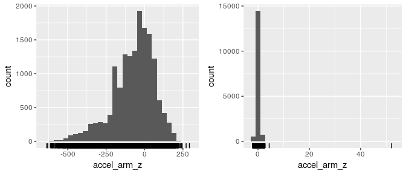
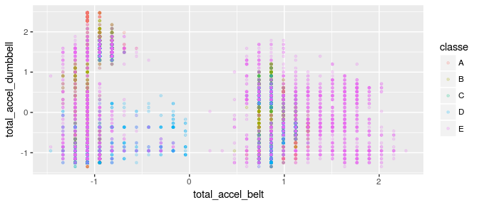
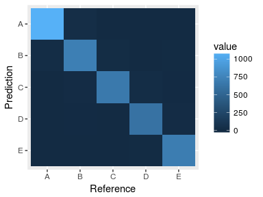

# Final analysis for HAR workout data

```r
library(caret)
library(ggplot2)
library(plyr)
library(dplyr)
source('data_directories.R') # My own file management functions
```


# Introduction

In this file I present a summary of my analysis describing the important steps/choices I have made, together with the final trained model. I have split my analysis in 3 stages: i) data cleaning, ii) exploratory analysis, iii) final model. Some of the details are referred to other Rmarkdown files who's reading are **not** essential for this report!

# Data cleaning
Further data cleaning details are found in the repository in the files data_cleaning.* . I did the following:

* **Downloaded:**  the raw data locally into 'data/raw/'
* **Removed irrelevant variables.** By using sapply, I removed variables that were found that have more that $90\%$ missing values. I found that the time stamps were not useful (could not find their meaning in the references and cannot see how they could be useful). I removed the factor variables 'new_window' and 'num_window' who's names suggest they have nothing to do with exercise performance (could not find information about them either).
* **Saved clean data**: The final data had 54 columns and I saved both training and testing datasets in 'data/clean/' for later use.

# Exploratory analysis
Further exploratory analysis details are found in the repository in the files exploratory_analysis.*.

First I've set the seed, loaded the data and created a test set (to leave untouched until the very end so that I can report "out of sample" estimates).

```r
set.seed(10819)
data_dirname <- 'data'                  # data dir name
clean_data_subdirname<-'clean'          # clean data dir name  
training_clean<-paste(data_dirname,'/', # clean data filename
                clean_data_subdirname,
                '/','training_clean.csv',
                sep='')                 
training0 <- read.csv(training_clean)   # reading training file
training0<- training0[,                 # removing redundant index column
                      2:(dim(training0)[[2]])]  
indTrain<-createDataPartition(          # Using 80% for training and CV
        training0$classe,p=0.80,list=FALSE)
training<-training0[indTrain,]          # Trainingand CV set
testing<-training0[-indTrain,]          # Test set for final estimates
```

For the 52 numerical features in the dataset, then I made plots of all distributions to check for outliers. I show here two examples of features without (left) and with (right) outliers

```r
require(gridExtra)
numeric_vars<-colnames(training)[2:(length(colnames(training))-1)]
df<-as.data.frame(lapply(training[numeric_vars],as.numeric))
plot1<-ggplot(df,aes(df['accel_arm_z']))+geom_histogram()+xlab('accel_arm_z')+geom_rug()
plot2<-ggplot(df,aes(df['gyros_dumbbell_y']))+geom_histogram()+xlab('accel_arm_z')+geom_rug()
grid.arrange(plot1, plot2, ncol=2)
```

<!-- -->

So then I remove all data points that are more than $10\sigma$ away from the center of the distributions and performed feature center/scale

```r
list_bad<-character()
for(name in colnames(df)){
  # compute mean
  meanval<-mean(as.vector(df[,name]))
  # compute standard deviation
  sdval<-sd(as.vector(df[,name]))
  # check if an outlier
  df_temp<-df[as.vector((df[name]>(meanval+10*sdval)) | (df[name]<(meanval-10*sdval))),]
  if(dim(df_temp)[[1]]>0){
    list_bad<-append(list_bad,rownames(df_temp))
  }
}
indBad<-as.numeric(unique(list_bad)) # list of outliers
training_no_outliers<-training[-indBad,] # train data without outliers
# Applying feature scalling
preObj<-preProcess(training_no_outliers[-c(1,54)],method=c('center','scale'))
# Now prepare new dataframe
training_pre1<-predict(preObj,training_no_outliers[-c(1,54)])
training_pre1['user_name']<-training_no_outliers[1]
training_pre1['classe']<-training_no_outliers[54]
# And also do it to the testing set for later
testing_pre1<-predict(preObj,testing[-c(1,54)])
testing_pre1['user_name']<-testing[1]
testing_pre1['classe']<-testing[54]
```

I also experimented PCA to further reduce the number of features, but the variance was too spread out among all variables. I also did a few 2D scatter plots but they did not show any obvious trends (which is hard given the large number of features of 52). An example is as follows


```r
ggplot(training_pre1,aes(x=total_accel_belt,y=total_accel_dumbbell,colour=classe))+geom_point(size=1,alpha=0.2)
```

<!-- -->

Next, since this is a multiclass problem, I looked at how much mean feature values differed according to each 'classe' (showing here only two illustrative features)

```r
test<-group_by(training_pre1[-c(53)],classe)
summary_vars_class<-summarise_each(test,funs(mean))
summary_vars_class[1:3]
```

```
## # A tibble: 5 x 3
##   classe   roll_belt   pitch_belt
##   <fctr>       <dbl>        <dbl>
## 1      A -0.08852167 -0.002336930
## 2      B  0.01135972 -0.009222280
## 3      C  0.01846681 -0.059073095
## 4      D -0.05952530  0.067351420
## 5      E  0.16054392  0.009318791
```
and then created a list of the most important ones (32 in total) based on this criterion

```r
variability_summary_vars<-apply(summary_vars_class,2,sd)
variability_summary_vars<-variability_summary_vars[2:length(variability_summary_vars)]
ordered_var_sumr_vars<-variability_summary_vars[order(variability_summary_vars[2:length(variability_summary_vars)],decreasing=TRUE)]
important_vars<-names(ordered_var_sumr_vars[ordered_var_sumr_vars>0.1])
important_vars<-c(important_vars,'classe')
important_vars
```

```
##  [1] "roll_forearm"         "accel_arm_z"          "magnet_arm_z"        
##  [4] "roll_dumbbell"        "magnet_arm_x"         "magnet_belt_y"       
##  [7] "magnet_arm_y"         "roll_arm"             "magnet_forearm_x"    
## [10] "yaw_forearm"          "accel_dumbbell_x"     "accel_dumbbell_z"    
## [13] "magnet_belt_z"        "magnet_dumbbell_y"    "accel_dumbbell_y"    
## [16] "yaw_arm"              "magnet_dumbbell_z"    "accel_forearm_x"     
## [19] "accel_arm_y"          "yaw_dumbbell"         "pitch_dumbbell"      
## [22] "pitch_forearm"        "magnet_dumbbell_x"    "magnet_forearm_y"    
## [25] "accel_arm_x"          "pitch_arm"            "accel_belt_z"        
## [28] "total_accel_dumbbell" "total_accel_forearm"  "accel_forearm_y"     
## [31] "total_accel_belt"     "total_accel_arm"      "classe"
```

The final trainig data is (I am keeping 52 features for now!)

```r
training_final<-training_pre1[sample(1:dim(training_pre1)[[1]],dim(training_pre1)[[1]],replace = FALSE),]
```

Finally, to explore various algorithms quickly, I decided to train several small bootstrap samples of the training set (size 2000) with 5 different algorithms. In this way I managed to explore efficiently to find the best algorithm to train. I used caret to train a 'gbm' (stochastic gradient boosting), 'rf' (a random forest), 'lda' (linear discriminant), 'svmLinear' (linear support vector machine) and an 'svmRadial' (radial basis function SVM) with 3 different choices of features: i) 53 (with username), ii) 52 (without username), iii) 32 (important_vars above). I found that the best of the 20 models was 'gbm' with 52 features and that the option with 32 features might be useful as well (to speed up).

# Final model training
Here I use cross validation with 10-folds. I use 6 cores in parallel.

```r
library(doMC)
registerDoMC(cores = 6)
gbm52<- train(classe~.,method='gbm',data=training_final[,c(colnames(training_final)[1:52],'classe')],trControl = trainControl("cv",10),verbose=F)
gbm52
```

```
## Stochastic Gradient Boosting 
## 
## 15696 samples
##    52 predictors
##     5 classes: 'A', 'B', 'C', 'D', 'E' 
## 
## No pre-processing
## Resampling: Cross-Validated (10 fold) 
## Summary of sample sizes: 14127, 14127, 14126, 14126, 14129, 14125, ... 
## Resampling results across tuning parameters:
## 
##   interaction.depth  n.trees  Accuracy   Kappa    
##   1                   50      0.7503826  0.6835855
##   1                  100      0.8216104  0.7742631
##   1                  150      0.8549312  0.8163759
##   2                   50      0.8541044  0.8151129
##   2                  100      0.9066019  0.8818098
##   2                  150      0.9310016  0.9126875
##   3                   50      0.8974289  0.8701558
##   3                  100      0.9432983  0.9282416
##   3                  150      0.9629833  0.9531705
## 
## Tuning parameter 'shrinkage' was held constant at a value of 0.1
## 
## Tuning parameter 'n.minobsinnode' was held constant at a value of 10
## Accuracy was used to select the optimal model using  the largest value.
## The final values used for the model were n.trees = 150,
##  interaction.depth = 3, shrinkage = 0.1 and n.minobsinnode = 10.
```
The final confusion matrix is found by applying to the test set.

```r
gbm52_predict<-predict(gbm52,testing_pre1) 
conf_mat<-confusionMatrix(data = gbm52_predict, reference = testing_pre1$classe)
conf_mat
```

```
## Confusion Matrix and Statistics
## 
##           Reference
## Prediction    A    B    C    D    E
##          A 1089   31    0    2    1
##          B   23  713   17    3    8
##          C    3   11  665   21    4
##          D    1    4    1  609   14
##          E    0    0    1    8  694
## 
## Overall Statistics
##                                           
##                Accuracy : 0.961           
##                  95% CI : (0.9545, 0.9668)
##     No Information Rate : 0.2845          
##     P-Value [Acc > NIR] : < 2.2e-16       
##                                           
##                   Kappa : 0.9507          
##  Mcnemar's Test P-Value : 6.728e-05       
## 
## Statistics by Class:
## 
##                      Class: A Class: B Class: C Class: D Class: E
## Sensitivity            0.9758   0.9394   0.9722   0.9471   0.9626
## Specificity            0.9879   0.9839   0.9880   0.9939   0.9972
## Pos Pred Value         0.9697   0.9332   0.9446   0.9682   0.9872
## Neg Pred Value         0.9904   0.9854   0.9941   0.9897   0.9916
## Prevalence             0.2845   0.1935   0.1744   0.1639   0.1838
## Detection Rate         0.2776   0.1817   0.1695   0.1552   0.1769
## Detection Prevalence   0.2863   0.1947   0.1795   0.1603   0.1792
## Balanced Accuracy      0.9818   0.9616   0.9801   0.9705   0.9799
```
And it can be neatly visualised as follows

```r
library(reshape2)
melted_confmat <- melt(conf_mat$table)
ggplot(data = melted_confmat , aes(x=Reference, y=Prediction, fill=value)) + 
  geom_tile()+ylim(rev(levels(melted_confmat$Prediction)))
```

<!-- -->

In conclusion, we have quite high accuracy, precision and recall.
